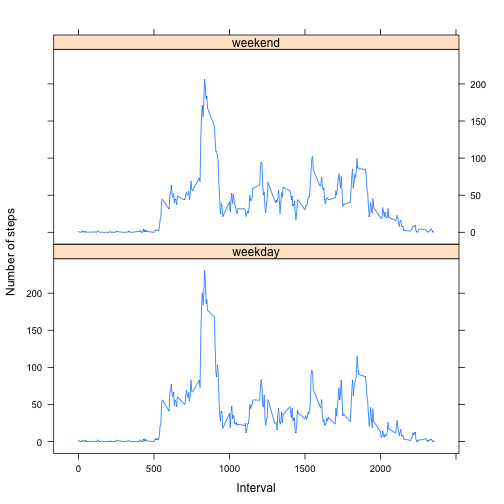

# Reproducible Research: Peer Assessment 1


## Loading and preprocessing the data


```r

# get data
setwd(".")
data <- read.table("activity.csv", header = TRUE, sep = ",", stringsAsFactors = FALSE)
str(data)
colnames(data)

# check steps
table(data$steps)
summary(data$steps)
hist(data$steps)
```

 

```r
hist(data$steps[!is.na(data$steps) & data$steps != 0])
```

 

```r


# check date
head(data$date)
data$date <- as.Date(data$date)
str(data)
table(data$date)
min(data$date)
day <- as.numeric(data$date - min(data$date))
table(day)
as.numeric(names(table(day)))
0:60

data <- cbind(data, day)
str(data)

# check interval
noExpectedIntervals <- 24 * 60/5
noExpectedIntervals
length(unique(data$interval))

# check intervals per day
count <- NULL
for (i in 0:60) {
    count[i] <- length(unique(data$interval[data$day == i]))
}
count
sum(count != noExpectedIntervals)

# construct a matrix where each row is a day, each column is a time interval
# and each cell contains the number of steps taken on that day and time
# interval
days <- unique(data$day)
intervals <- unique(data$interval)

data.m <- matrix(data = data$steps, byrow = TRUE, nrow = length(days), ncol = length(intervals), 
    dimnames = list(day = days, interval = intervals))
data.m[34:36, 200:206]

sum(is.na(data.m))
```

## What is mean total number of steps taken per day?


```r
# total steps per day
dailySums <- rowSums(data.m, na.rm = TRUE)
dailySums

# split the data by day - alternative calculation using tabular data
# split.data <- split(data, data$day) dailySums <- unlist(lapply(split.data,
# function(x) sum(x$steps, na.rm=TRUE))) dailySums

# explore dailySums
summary(dailySums)
boxplot(dailySums)
```

 

```r
hist(dailySums, probability = TRUE)
dens <- density(dailySums, na.rm = TRUE)
rug(dailySums)
lines(dens)
```

 

```r
table(round(dailySums))
# overall mean steps per day
meanSumSteps <- mean(dailySums, na.rm = TRUE)
meanSumSteps
# 9354
medianSumSteps <- median(dailySums, na.rm = TRUE)
medianSumSteps
# 10395
```


```r


# analysis of daily means
dailyMeans <- rowMeans(data.m, na.rm = TRUE)
dailyMeans

# create a list of tables - one for each day - alternative calculation using
# tabular data split.data <- split(data, data$day) dailyMeans <-
# unlist(lapply(split.data, function(x) mean(x$steps, na.rm=TRUE)))
# dailyMeans

# explore dailyMeans
summary(dailyMeans)
boxplot(dailyMeans)
```

 

```r
hist(dailyMeans, probability = TRUE)
dens <- density(dailyMeans, na.rm = TRUE)
rug(dailyMeans)
lines(dens)
```

 

```r
table(round(dailyMeans))
# overall mean steps per day
meanSteps <- mean(dailyMeans, na.rm = TRUE)
meanSteps
# 37
medianSteps <- median(dailyMeans, na.rm = TRUE)
medianSteps
# 37
```


## What is the average daily activity pattern?


```r

# colnames(data) complete.data <- data[complete.cases(data),]
# head(complete.data) first plot without averaging across days
# with(complete.data, plot(steps ~ interval, type='l'))

# split the data on time intervals interval.data <- split(data,
# data$interval) intervalMeanSteps <- unlist(lapply(interval.data,
# function(x) mean(x$steps, na.rm=TRUE))) head(intervalMeanSteps) intervals
# <- names(intervalMeanSteps) length(intervals)

intervalMeanSteps <- colMeans(data.m, na.rm = TRUE)
```


### 1. Make a time series plot (i.e. `type = "l"`) of the 5-minute interval (x-axis) and the average number of steps taken, averaged across all days (y-axis)


```r

plot(intervalMeanSteps ~ intervals, type = "l")
```

 


### 2. Which 5-minute interval, on average across all the days in the dataset, contains the maximum number of steps?


```r

intervalMeanSteps[which(intervalMeanSteps == max(intervalMeanSteps))]
# 206 steps during time interval 835 (between 830-835 minutes)
hours <- 835%/%60
minutes <- 835%%60
cat(hours, ":", minutes)  #13:55 - perhaps a run after lunch
```

## Imputing missing values

### 1. Calculate and report the total number of missing values in the dataset (i.e. the total number of rows with `NA`s)


```r
missing <- sum(is.na(data.m))
missing
# 2304

missingDays <- sum(dailySums == 0)
missingDays
# 8
```


### 2. Devise a strategy for filling in all of the missing values in the dataset. The strategy does not need to be sophisticated. For example, you could use the mean/median for that day, or the mean for that 5-minute interval, etc.

I will fill in missing values with values from the mean for that 5 minute interval using the "intervalMeanSteps" vector.
n
Note that this vector has the same length as the number of columns in the data matrix (day * interval)
length(intervalMeanSteps)
dim(data.m)


### 3. Create a new dataset that is equal to the original dataset but with the missing data filled in.


```r

# the 'replace' function is applied to each row of the data matrix (day *
# interval) the indices of NA values are identified using the 'which'
# function' NA values are replaced by their corresponding values in the
# intervalMeanSteps vector note that 'apply' fills the result matrix by
# columns (instead of by row) so a transpose operation has to be performed
# to restore the original dimensionality of the matrix
impData.m <- t(apply(data.m, 1, function(x) replace(x, list = which(is.na(x)), 
    values = intervalMeanSteps[which(is.na(x))])))

# spot check
sum(is.na(impData.m))
dim(data.m)
dim(impData.m)
data.m[34:36, 200:206]
impData.m[34:36, 200:206]
```


### 4. Make a histogram of the total number of steps taken each day and Calculate and report the **mean** and **median** total number of steps taken per day. Do these values differ from the estimates from the first part of the assignment? What is the impact of imputing missing data on the estimates of the total daily number of steps?


```r
# total steps per day
newDailySums <- rowSums(impData.m, na.rm = TRUE)
newDailySums


# explore dailySums
summary(newDailySums)
boxplot(newDailySums)
```

 

```r
hist(newDailySums, probability = TRUE)
dens <- density(newDailySums, na.rm = TRUE)
rug(newDailySums)
lines(dens)
```

 

```r
table(round(newDailySums))
# overall mean steps per day
newMeanSumSteps <- mean(newDailySums, na.rm = TRUE)
newMeanSumSteps
meanSumSteps
# 9354
newMedianSumSteps <- median(newDailySums, na.rm = TRUE)
newMedianSumSteps
medianSumSteps
# 10395
```


## Are there differences in activity patterns between weekdays and weekends?

### 1. Create a new factor variable in the dataset with two levels -- "weekday" and "weekend" indicating whether a given date is a weekday or weekend day.


```r

# make a vector of factors indicating if each of the 61 observation days is
# a weekday or weekend
theDates <- unique(data$date)
theseDays <- weekdays(theDates)
isWeekend <- as.numeric(theseDays == "Saturday" | theseDays == "Sunday")
isWeekend.f <- factor(isWeekend, levels = c(0, 1), labels = c("weekday", "weekend"))
isWeekend.f
sum(isWeekend.f == "weekend")
sum(isWeekend.f != "weekend")


# subset the data (by weekend and weekday)
weekendData.m <- impData.m[isWeekend, ]
dim(weekendData.m)
weekdayData.m <- impData.m[!isWeekend, ]
dim(weekdayData.m)
dim(impData.m)

# find means for each time interval for weekend and weekday data sets there
# are 288 time intervals in each day
weekendMeans <- colMeans(weekendData.m)
length(weekendMeans)
weekdayMeans <- colMeans(weekdayData.m)
length(weekdayMeans)

# create a data frame consolidating data
allData.df <- data.frame(weekend = weekendMeans, weekday = weekdayMeans, intervals = intervals)
str(allData.df)
```


### 2. Make a panel plot containing a time series plot (i.e. `type = "l"`) of the 5-minute interval (x-axis) and the average number of steps taken, averaged across all weekday days or weekend days (y-axis). The plot should look something like the following, which was creating using **simulated data**:


```r

library(lattice)
xyplot(weekday + weekend ~ intervals, data = allData.df, type = "l", layout = c(1, 
    2), ylab = "Number of steps", xlab = "Interval", outer = TRUE)
```

 

## Conclusions


